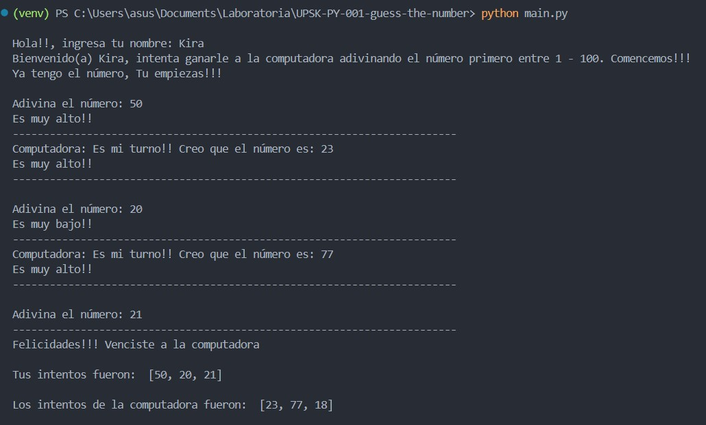

# Adivina el Número - Guess the Number

## Índice

- [1. Resumen del Proyecto](#1-resumen-del-proyecto)
- [2. Objetivos de Aprendizaje](#2-objetivos-de-aprendizaje)

---

## 1. Resumen del Proyecto

_Guess The Number_ es un juego interactivo que se desarrolla en el terminal,
donde la jugadora y el ordenador se turnan para intentar adivinar un número
aleatorio entre 1 y 100. Deben tener en cuenta la tentativa anterior, si fue
"muy alta" o "muy baja".

## 2. Objetivos de Aprendizaje

Reflexiona y luego marca los objetivos que has llegado a entender y aplicar en tu proyecto. Piensa en eso al decidir tu estrategia de trabajo.

### Python

- [ ] **Variables (declaración, asignación, ámbito)**

  

Links

  * [Variables in Python – Real Python (en inglés)](https://realpython.com/python-variables/)
  * [Variables in Python - GeeksforGeeks (en inglés)](https://www.geeksforgeeks.org/python-variables/)

- [ ] **Uso de condicionales (if, elif, ternario)**

  

Links

  * [Conditional Statements in Python – Real Python (en inglés)](https://realpython.com/python-conditional-statements/)

- [ ] **Operadores (identidad, aritméticos, comparación etc)**

  

Links

  * [Python Operators - GeeksforGeeks (en inglés)](https://www.geeksforgeeks.org/python-operators/)

- [ ] **Docstrings (y su diferencia de comentarios)**

  

Links

  * [Docstrings - Python Docs (en inglés)](https://docs.python.org/3/tutorial/controlflow.html#documentation-strings)

- [ ] **Linting (pylint)**

  

Links

  * [Pylint - Documentación oficial](https://pylint.pycqa.org/en/latest/)
  * [Linting Python in Visual Studio Code - Visual Studio Code Docs (en inglés)](https://code.visualstudio.com/docs/python/linting)

#### Tipos de datos

- [ ] **Tipos de datos primitivos (int, float, str, bool)**

  

Links

  * [Data Types - Python Docs (en inglés)](https://docs.python.org/3/library/datatypes.html)
  * [Data types in Python (en inglés)](https://www.educative.io/answers/data-types-in-python)

- [ ] **Listas (arrays)**

  

Links

  * [Lists - Python Docs (en inglés)](https://docs.python.org/3/tutorial/datastructures.html#more-on-lists)
  * [Lists and Tuples in Python - Real Python (en inglés)](https://realpython.com/python-lists-tuples/)

- [ ] **Tuples**

  

Links

  * [Tuples - Python Docs (en inglés)](https://docs.python.org/3/tutorial/datastructures.html#tuples-and-sequences)
  * [Lists and Tuples in Python - Real Python (en inglés)](https://realpython.com/python-lists-tuples/)

- [ ] **Dictionaries (Dicts)**

  

Links

  * [Dictionaries - Python Docs (en inglés)](https://docs.python.org/3/tutorial/datastructures.html#dictionaries)
  * [Dictionaries in Python - Real Python (en inglés)](https://realpython.com/python-dicts/)

- [ ] **Sets**

  

Links

  * [Sets - Python Docs (en inglés)](https://docs.python.org/3/tutorial/datastructures.html#sets)
  * [Sets in Python - Real Python (en inglés)](https://realpython.com/python-sets/)

#### Funciones

- [ ] **Conceptos basicos (params, args, default values, return)**

  

Links

  * [Python Functions - GeeksforGeeks (en ingles)](https://www.geeksforgeeks.org/python-functions/)

#### Iteración

- [ ] **Uso de bucles/ciclos (while, for..in)**

  

Links

  * [Loops in Python - For, While and Nested Loops - GeeksforGeeks](https://www.geeksforgeeks.org/loops-in-python/)
  * [Loops - Learn Python - Free Interactive Python Tutorial](https://www.learnpython.org/en/Loops)

#### Testing en Python

- [ ] **Pruebas unitarias (unit tests, unittest, pytest)**

  

Links

  * [unittest - Python Docs (en inglés)](https://docs.python.org/3/library/unittest.html)
  * [pytest - Documentación oficial](https://docs.pytest.org/en/6.2.x/)

- [ ] **Uso de mocks (y patch)**

  

Links

  * [unittest.mock - Python Docs (en inglés)](https://docs.python.org/3/library/unittest.mock.html)
  * [Python Mock Library - Real Python (en inglés)](https://realpython.com/python-mock-library/)

- [ ] **Uso de fixtures**

  

Links

  * [pytest fixtures - Documentación oficial](https://docs.pytest.org/en/6.2.x/fixture.html)

#### Modularización

- [ ] **Módulos**

  

Links

  * [Módulos - Python Docs (en inglés)](https://docs.python.org/3/tutorial/modules.html)

#### Manejo de dependencias

- [ ] **pip (instalación y uso de paquetes)**

  

Links

  * [pip - Python Docs (en inglés)](https://docs.python.org/3/installing/index.html)

- [ ] **Virtual Environment (ambientes virtuales, virtualenv)**

  

Links

  * [venv — Creation of virtual environments — Python 3.12.2 documentation (en inglés)](https://docs.python.org/3/library/venv.html)
  * [Python Virtual Environments: A Primer – Real Python (en inglés)](https://realpython.com/python-virtual-environments-a-primer/)

- [ ] **requirements.txt**

  

Links

  * [requirements.txt - Documentación oficial](https://pip.pypa.io/en/stable/user_guide/#requirements-files)

